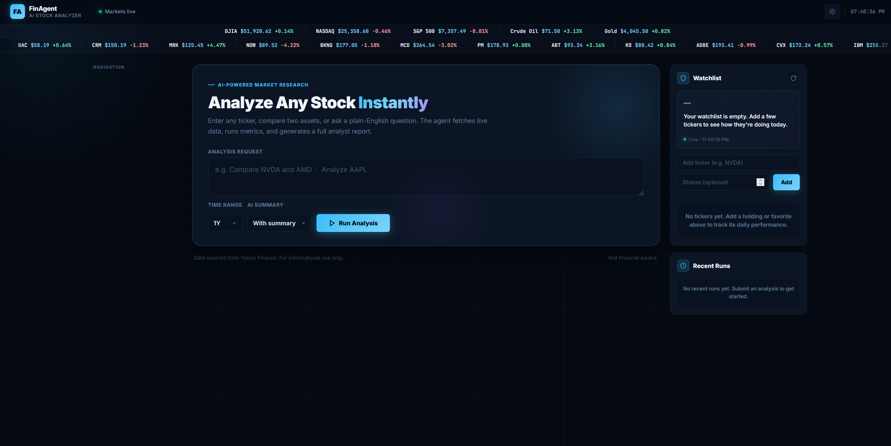
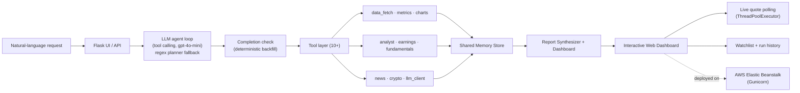
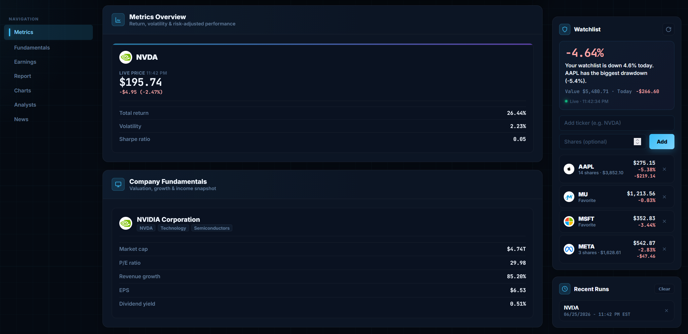
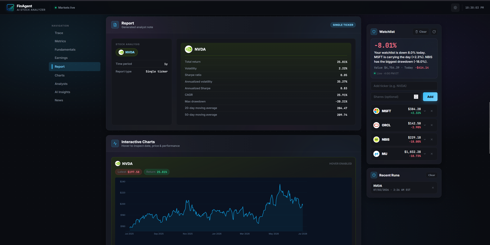
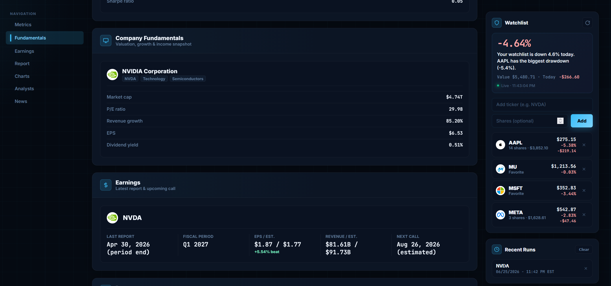
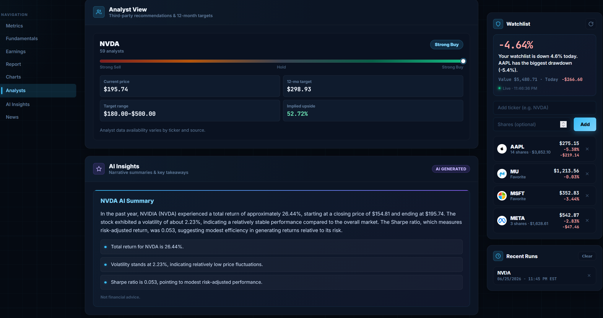
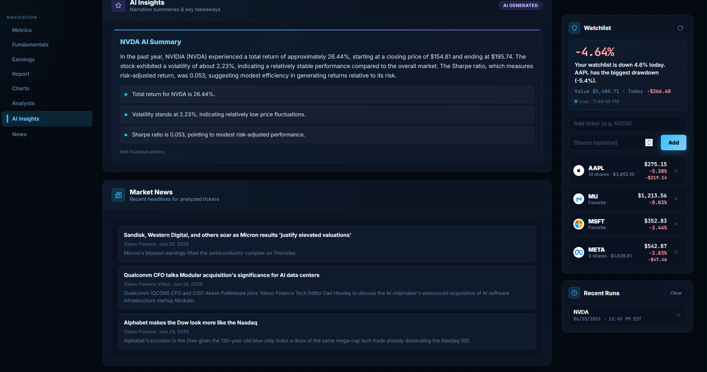

<div align="center">

# Finance Agent Workflow

### An LLM agent that turns one plain-English request into a full equities & crypto research workspace — the model calls 10+ market-data tools itself, live in production on AWS.

[](https://www.python.org/)
[](https://flask.palletsprojects.com/)
[](https://gunicorn.org/)
[](https://aws.amazon.com/elasticbeanstalk/)
[](https://plotly.com/)
[](https://platform.openai.com/)
[](https://docs.pytest.org/)

**[▶ Live Demo](https://askfinagent.com)** — running on AWS Elastic Beanstalk

Plan analyses from natural language, compare performance, inspect live prices, track a watchlist, review fundamentals, scan earnings, read market news, and generate analyst-style reports — all from one request.

</div>



---

## Table Of Contents

- [Overview](#overview)
- [Architecture](#architecture)
- [Highlights](#highlights)
- [Screenshots](#screenshots)
- [Demo Prompts](#demo-prompts)
- [How It Works](#how-it-works)
- [Tech Stack](#tech-stack)
- [Getting Started](#getting-started)
- [Deployment](#deployment)
- [OpenAI Integration](#openai-integration)
- [Project Structure](#project-structure)
- [What This Project Demonstrates](#what-this-project-demonstrates)
- [Limitations](#limitations)
- [Future Improvements](#future-improvements)
- [License](#license)

---

## Overview

Finance Agent Workflow turns a natural-language finance request into a complete research workspace. Instead of one monolithic handler, it uses a **real LLM agent**: the model receives the request plus 10+ focused tools as function schemas and decides which to call — resolving company names to tickers, fetching prices, computing metrics, pulling analyst/earnings/fundamentals/news data — while a shared **memory store** coordinates the results into an interactive dashboard, live quote feeds, and a generated report. A deterministic completion check and a regex-planner fallback keep every run resilient, even with no API key at all.

It supports both equities and major crypto assets through `yfinance`, and is **deployed in production on AWS Elastic Beanstalk** behind a Gunicorn WSGI server, with optional OpenAI-powered summaries enabled through environment-based secrets.

It is designed to feel like a compact research terminal: plan-driven, modular, resilient to missing third-party data, and built end-to-end from request parsing to a live, hosted deployment.

---

## Architecture

The primary path is a genuine **LLM tool-calling agent loop**: the model (OpenAI `gpt-4o-mini`) receives the user's request plus the tool layer as function schemas, and decides which tools to call, in what order, until the research workspace is complete. A deterministic completion check then backfills anything the model skipped, and when no API key is configured (or the LLM path fails), the original regex **Planner → Agent** pipeline takes over — so the app always produces a result.



- **LLM agent (`llm_agent.py`)** — the tool-calling loop: hands the model the request and the tool schemas, executes each chosen tool, feeds compact results back, and stops at `finish()` or a hard iteration/budget cap. A code-level completion check guarantees the dashboard's data contract even if the model skips steps.
- **Tool registry (`tools/agent_tools.py`)** — OpenAI function schemas plus dispatch wrappers around the tool layer; enforces the two-ticker cap in code, resolves company names via live Yahoo symbol search (`resolve_symbol`), and turns tool failures into error payloads the model can adapt to.
- **Fallback planner (`planner.py`)** — converts plain English into a structured task list with regex/keyword parsing; used when no API key is set or the LLM path fails.
- **Fallback agent (`agent.py`)** — executes the fallback plan task-by-task, writing every result to shared memory and wrapping each third-party call so a partial failure never crashes the run.
- **Tool layer (`tools/`)** — focused, single-responsibility modules for data, metrics, charting, analyst data, earnings, fundamentals, news, crypto normalization, and the optional LLM client.
- **Memory (`memory/store.py`)** — a shared key-value blackboard the planner, agent, reports, and dashboard all read from.
- **Reports (`reports/`)** — synthesize a text report and build the dashboard artifact from memory.

---

## Highlights

| Feature | What It Does |
| --- | --- |
| LLM tool-calling agent | The model reads the request and decides which of 10+ tools to call, in what order — resolving names to tickers, fetching prices, computing metrics, and pulling analyst/earnings/fundamentals/news data. Understands messy prompts like `Compare Apple vs Nvidia over 6 months` or `How did the maker of the iPhone do this year?`. |
| Deterministic safety net | A completion check backfills any step the model skips, hard caps on iterations and tool calls bound cost, and a regex planner takes over with no API key — so every run finishes with a complete workspace. |
| Live execution trace | A streaming panel replays the agent loop step by step — each model decision and tool call with real timing and status — turning the run into a transparent trace instead of a black box. |
| Stocks and crypto | Supports equities plus crypto aliases such as `BTC`, `ETH`, `Bitcoin`, and `Ethereum` through normalized `yfinance` tickers. |
| Live watchlist | Persistent watchlist (with optional share holdings) showing live prices, value-weighted daily P/L, position values, and an auto-generated leader/laggard narrative. |
| Real-time quotes | Browser polling backed by concurrent quote endpoints (`ThreadPoolExecutor`, up to 20 parallel fetches) plus a bulk live market ticker tape. |
| Quantitative metrics | Computes total return, volatility, Sharpe & annualized Sharpe, CAGR, max drawdown, and 20/50-day moving averages. |
| Custom date ranges | Understands both relative ranges (`last 6 months`) and explicit ranges (`from 2024-01 to 2024-06`). |
| Company fundamentals | Valuation, growth, profitability, sector, industry, and market cap snapshots where available. |
| Earnings panel | Latest report context, fiscal period, EPS, revenue, estimates, and next-call estimates when available. |
| Analyst view | Recommendation posture, analyst count, price targets, target range, and implied upside. |
| Interactive charts | Plotly individual price charts and normalized growth-comparison charts with hover inspection. |
| Market news | Pulls recent ticker-related news into the same workflow so research context stays nearby. |
| Optional AI summaries | OpenAI-generated plain-English summaries that degrade gracefully when the key or API is unavailable. |
| Recent runs | Saves previous analyses and lets you rerun them directly from the UI. |
| Resilient by design | Every external call is isolated so missing fundamentals, earnings, or analyst data never breaks a run. |
| Tested | An offline `pytest` suite covers the agent loop, tool dispatch, caps, and fallback routing — OpenAI and `yfinance` are faked, so no key or network is needed. |

---

## Screenshots

### Dashboard Overview

A workstation-style landing view with a live market ticker tape, a plain-English request box, interval and summary controls, a live watchlist panel, and recent-run history.


### Performance Metrics

A metrics overview card surfaces the latest price, total return, volatility, and Sharpe ratio at a glance for each analyzed ticker.



### Generated Report And Interactive Charts

Each run produces an analyst-style report with the full metric set — return, volatility, Sharpe, annualized Sharpe, CAGR, max drawdown, and moving averages — alongside interactive Plotly price charts with hover inspection.



### Company Fundamentals And Earnings

Research panels surface valuation, growth, sector and industry context, market cap, EPS, revenue, and upcoming earnings details without leaving the workflow.



### Analyst View And AI Summary

Analyst recommendation posture, price targets, target range, and implied upside sit alongside an optional AI-generated, plain-English summary of the analysis.



### Market News

Recent ticker-related headlines are pulled into the same workflow so research context stays nearby.



---

## Demo Prompts

Straightforward requests:

```text
Analyze AAPL and NVDA
Analyze BTC and ETH
Analyze MSFT and GOOGL for 6 months
Analyze TSLA for 3 months no summary
Compare Bitcoin and Ethereum over 1 year
Analyze AAPL from 2024-01 to 2024-06
```

Because an LLM agent parses the request, it also handles messy, conversational phrasing that a keyword parser can't — company names instead of tickers, typos, and casual comparisons:

```text
Compare Apple vs Nvidia over the last 6 months
How did the maker of the iPhone do this year?
Stack Costco up against that big-box rival Walmart
Take a look at Nvidea for me       # typo — resolved to NVDA
```

The app also includes dropdown controls for:

- Time interval: `1D`, `5D`, `1M`, `3M`, `6M`, `1Y`, `2Y`, `5Y`.
- Summary mode: with summary or no summary.

---

## How It Works

The workflow is intentionally modular:

- `llm_agent.py` runs the LLM tool-calling loop (with caps and a deterministic completion check) that orchestrates the analysis.
- `tools/agent_tools.py` exposes the tool layer as OpenAI function schemas and writes every result into shared memory.
- `planner.py` extracts tickers, crypto symbols, time periods, custom date ranges, and summary preferences (fallback path).
- `agent.py` executes the fallback task plan, fetching data and analytics tool-by-tool with isolated error handling.
- `tools/` contains focused data, charting, crypto, earnings, fundamentals, analyst, news, and LLM helpers.
- `memory/store.py` is the shared store every stage reads from and writes to.
- `reports/` synthesizes the text report and dashboard artifact.
- `app.py` serves the dashboard plus concurrent live-quote, ticker-tape, and watchlist APIs.
- `history.py` saves and reloads recent analyses for quick reruns.

---

## Tech Stack

| Layer | Tools |
| --- | --- |
| Backend | Python 3.11, Flask, Gunicorn |
| Architecture | LLM tool-calling agent loop (OpenAI function calling) with a Planner / Agent / Tools / Memory fallback pipeline |
| Concurrency | `ThreadPoolExecutor`, threaded WSGI, background cache warming |
| Market data | yfinance |
| Data processing | pandas, NumPy |
| Visualization | Plotly, Matplotlib |
| Frontend | HTML, CSS, JavaScript |
| AI | OpenAI API — tool-calling agent loop + structured summaries (optional, graceful degradation) |
| Testing | pytest (offline: OpenAI and yfinance faked/mocked) |
| Deployment | AWS Elastic Beanstalk, Gunicorn, Procfile, environment-based secrets |

---

## Getting Started

### 1. Clone The Repository

```bash
git clone https://github.com/TheAliAmir28/finance-agent-workflow.git
cd finance-agent-workflow
```

### 2. Create A Virtual Environment

Windows PowerShell:

```powershell
python -m venv .venv
.\.venv\Scripts\Activate.ps1
```

macOS or Linux:

```bash
python -m venv .venv
source .venv/bin/activate
```

### 3. Install Dependencies

```bash
pip install -r requirements.txt
```

To run the test suite (fully offline — no API keys or network needed):

```bash
pip install -r requirements-dev.txt
pytest
```

### 4. Run The App

Development server:

```bash
python -m flask --app app run --host=0.0.0.0 --port=5000
```

Production-style (same server used in deployment):

```bash
gunicorn --bind :8000 --workers 1 --threads 8 --timeout 120 app:app
```

Then open `http://127.0.0.1:5000` (dev) or `http://127.0.0.1:8000` (gunicorn).

> Tip: with `--host=0.0.0.0` you can also open the app from a phone on the same Wi-Fi using the machine's LAN address (e.g. `http://192.168.1.152:5000`). Use `http`, not `https`, for the local server.

---

## Deployment

The app is deployed to **AWS Elastic Beanstalk** (Python 3.11 on Amazon Linux 2023) and served by **Gunicorn** via the included `Procfile`:

```text
web: gunicorn --bind :8000 --workers 1 --threads 8 --timeout 120 app:app
```

Deployment notes:

- **Single-instance** environment — the app persists run history, the watchlist, and caches to local disk, so a single instance keeps that state coherent (no load-balancer state splitting).
- **Secrets via environment** — `OPENAI_API_KEY` is set as an Elastic Beanstalk environment property, never committed to source.
- **`.ebignore`** keeps virtual environments, caches, and generated output out of the deployment bundle.
- The same `Procfile` works on other Python hosts (Render, Railway, Fly.io) with minimal changes.

---

## OpenAI Integration

A single environment variable, `OPENAI_API_KEY`, controls how much of the AI stack is active:

| `OPENAI_API_KEY` | Request handling | AI summaries |
| --- | --- | --- |
| **Set** | LLM tool-calling agent (`gpt-4o-mini`) plans and runs the analysis | Generated, unless toggled off in the UI |
| **Missing / API error** | Regex planner + deterministic agent take over automatically | Silently skipped |

The app is fully functional either way — the key upgrades the experience, it isn't a hard dependency. Every LLM call degrades gracefully: if the agent loop fails mid-run, the request is retried through the regex fallback, so a user always gets a result.

To enable the agent and summaries locally, set `OPENAI_API_KEY`:

Windows PowerShell:

```powershell
setx OPENAI_API_KEY "your_api_key_here"
```

macOS or Linux:

```bash
export OPENAI_API_KEY="your_api_key_here"
```

In production (Elastic Beanstalk), set it as an environment property:

```bash
eb setenv OPENAI_API_KEY=your_api_key_here
```

---

## Project Structure

```text
finance-agent-workflow/
|-- app.py                     # Flask routes, live quote / tape / watchlist APIs, UI orchestration
|-- llm_agent.py               # LLM tool-calling agent loop + deterministic completion check
|-- agent.py                   # Fallback: executes the regex task plan across the tool layer
|-- planner.py                 # Fallback: parses requests into tickers, ranges, and options
|-- watchlist.py               # Watchlist persistence and daily P/L summary
|-- history.py                 # Saves and loads recent analysis runs
|-- main.py                    # CLI entry point
|-- requirements.txt           # Python dependencies
|-- Procfile                   # Gunicorn production command (Elastic Beanstalk)
|-- .ebignore                  # Files excluded from the EB deployment bundle
|-- templates/
|   `-- index.html             # Main dashboard UI
|-- tools/
|   |-- agent_tools.py         # OpenAI tool schemas + dispatch wrappers for the agent loop
|   |-- symbol_search.py       # Shared Yahoo symbol lookup (typeahead + resolve_symbol tool)
|   |-- analyst.py             # Analyst recommendations and target data
|   |-- charts.py              # Static chart helpers (Matplotlib)
|   |-- crypto.py              # Crypto symbol normalization
|   |-- data_fetch.py          # Historical and quote data retrieval + caching
|   |-- earnings.py            # Earnings snapshots and estimates
|   |-- fundamentals.py        # Company fundamentals
|   |-- interactive_charts.py  # Plotly chart generation
|   |-- metrics.py             # Return, volatility, Sharpe, CAGR, drawdown calculations
|   |-- news.py                # Market news retrieval
|   `-- llm_client.py          # Optional OpenAI summary client
|-- reports/
|   |-- dashboard.py           # Dashboard artifact builder
|   `-- synthesizer.py         # Text report generator
|-- memory/
|   `-- store.py               # Shared memory store
`-- assets/
    `-- readme/                # README screenshot gallery
```

---

## What This Project Demonstrates

- **Agentic system design** — an LLM tool-calling loop that plans and orchestrates 10+ focused tools, hardened by iteration caps, code-enforced limits, and a deterministic completion check.
- **Natural-language understanding** — model-driven intent/entity resolution (with live symbol search) plus a regex parsing fallback.
- **Concurrency** — parallel live-quote pipelines with `ThreadPoolExecutor` and background cache warming behind a threaded WSGI server.
- **Quantitative analytics** — return, volatility, Sharpe, CAGR, and drawdown computed from price history.
- **Third-party API integration** — `yfinance` market data and the OpenAI API, both with graceful degradation.
- **Resilience** — isolated error handling so missing data never breaks an end-to-end run.
- **Full deployment** — packaged and shipped to production on AWS Elastic Beanstalk with Gunicorn and environment-based secrets.

It is more than a chart viewer: it is a small research system that plans work, fetches data concurrently, computes analytics, renders an interactive dashboard, tracks a live watchlist, saves history, and runs as a deployed web service.

---

## Limitations

- Market, fundamentals, earnings, analyst, and news data depend on third-party availability through `yfinance` and related sources.
- Some tickers may have incomplete earnings, revenue estimate, analyst, or company profile data.
- Live quote updates are intended for research convenience, not high-frequency trading.
- Run history, watchlist, and caches are stored on the instance's local disk, so they reset if the environment is rebuilt (a database backend is a planned improvement).
- This project is for education and portfolio demonstration. It is not financial advice.

---

## Future Improvements

- Export reports to PDF.
- Add persistent database-backed history and watchlist storage.
- Add authentication for hosted deployments.
- Add more data providers for richer earnings and analyst coverage.
- Add CI (the pytest suite exists; wire it into GitHub Actions).

---

## Disclaimer

This app is a research and learning tool. It does not provide financial advice, investment recommendations, or trading signals. Always verify data independently before making financial decisions.

---

## License

MIT License.

---

## Author

Built by [Ali Amir](https://github.com/TheAliAmir28) as a full-stack finance, data, and agent-workflow portfolio project.
