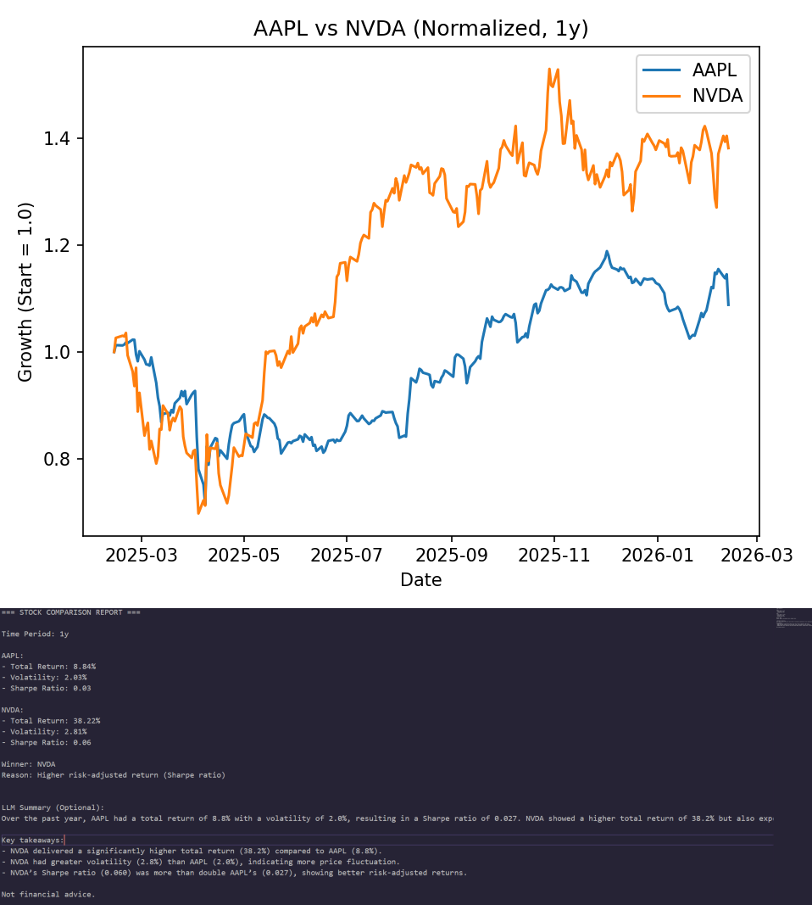
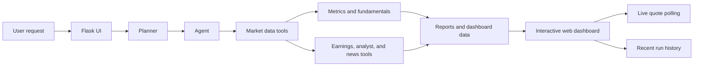

<div align="center">

# Finance Agent Workflow

### A local-first market research dashboard for stocks, crypto, charts, fundamentals, earnings, news, and analyst-style reports.

[](https://www.python.org/)
[](https://flask.palletsprojects.com/)
[](https://pypi.org/project/yfinance/)
[](https://plotly.com/)
[](#getting-started)

Analyze tickers, compare performance, inspect live prices, review fundamentals, scan earnings, read market news, and generate a clean report from one plain-English request.

</div>



---

## Table Of Contents

- [Overview](#overview)
- [Highlights](#highlights)
- [Demo Prompts](#demo-prompts)
- [How It Works](#how-it-works)
- [Tech Stack](#tech-stack)
- [Getting Started](#getting-started)
- [Use It On Your Phone](#use-it-on-your-phone)
- [Optional AI Summaries](#optional-ai-summaries)
- [Project Structure](#project-structure)
- [Resume Value](#resume-value)
- [Limitations](#limitations)
- [Future Improvements](#future-improvements)
- [License](#license)

---

## Overview

Finance Agent Workflow is a polished Flask application that turns a natural-language finance request into a complete local research workspace. It supports stocks and major crypto assets through `yfinance`, then builds a dashboard with live quote updates, performance metrics, company fundamentals, earnings context, analyst-style target data, interactive Plotly charts, market news, generated reports, and rerunnable recent analyses.

It is designed to feel like a compact research terminal: fast to run locally, easy to understand, and useful enough to show as a serious end-to-end portfolio project.

---

## Highlights

| Feature | What It Does |
| --- | --- |
| Plain-English requests | Parses prompts like `Analyze AAPL and NVDA` or `Analyze BTC and ETH` into structured analysis tasks. |
| Stocks and crypto | Supports equities plus crypto aliases such as `BTC`, `ETH`, `Bitcoin`, and `Ethereum` through normalized `yfinance` tickers. |
| Live price updates | Refreshes visible quote values in the browser without requiring a full page reload. |
| Metrics overview | Shows return, volatility, Sharpe ratio, winner callouts, and live movement. |
| Company fundamentals | Displays valuation, growth, profitability, sector, industry, market cap, beta, and related snapshots where available. |
| Earnings panel | Shows latest report context, fiscal period, EPS, revenue, estimates, and next earnings call estimates when available. |
| Analyst view | Presents recommendation posture, analyst count, price targets, target range, and implied upside. |
| Interactive charts | Uses Plotly for individual price charts and normalized growth comparison charts with hover inspection. |
| Market news | Pulls recent ticker-related news into the same workflow so research context stays nearby. |
| Recent runs | Saves previous analyses and lets you rerun them directly from the UI. |
| UI controls | Provides dropdowns for time interval and summary mode, so users are not forced to rely only on natural language. |
| Local network access | Can be opened from a phone on the same Wi-Fi network for quick mobile testing. |

---

## Demo Prompts

```text
Analyze AAPL and NVDA
Analyze BTC and ETH
Analyze MSFT and GOOGL for 6 months
Analyze TSLA for 3 months no summary
Compare Bitcoin and Ethereum over 1 year
```

The app also includes dropdown controls for:

- Time interval: `1M`, `3M`, `6M`, `1Y`, and more depending on the configured options.
- Summary mode: with summary or no summary.

---

## How It Works



The workflow is intentionally modular:

- `planner.py` extracts tickers, crypto symbols, time periods, and summary preferences.
- `agent.py` coordinates the research workflow and builds the result object.
- `tools/` contains focused data, charting, crypto, earnings, fundamentals, analyst, and news helpers.
- `templates/index.html` renders the full workstation-style dashboard.
- `history.py` saves and reloads recent analyses for quick reruns.

---

## Tech Stack

| Layer | Tools |
| --- | --- |
| Backend | Python, Flask, Gunicorn |
| Market data | yfinance |
| Data processing | pandas, NumPy |
| Visualization | Plotly, Matplotlib |
| Frontend | HTML, CSS, JavaScript |
| Optional AI | OpenAI API |
| Deployment-ready files | Procfile, `.ebignore`, Gunicorn command |

---

## Getting Started

### 1. Clone The Repository

```bash
git clone https://github.com/TheAliAmir28/finance-agent-workflow.git
cd finance-agent-workflow
```

### 2. Create A Virtual Environment

Windows PowerShell:

```powershell
python -m venv .venv
.\.venv\Scripts\Activate.ps1
```

Windows Command Prompt:

```bat
python -m venv .venv
.venv\Scripts\activate
```

macOS or Linux:

```bash
python -m venv .venv
source .venv/bin/activate
```

### 3. Install Dependencies

```bash
pip install -r requirements.txt
```

### 4. Run The App

```bash
python -m flask --app app run --host=0.0.0.0 --port=5000
```

Open the app locally:

```text
http://127.0.0.1:5000
```

---

## Use It On Your Phone

To test the app from a phone on the same Wi-Fi network:

1. Run Flask with LAN access enabled:

```bash
python -m flask --app app run --host=0.0.0.0 --port=5000
```

2. Look for the local network address in the terminal. It will look similar to:

```text
http://192.168.1.152:5000
```

3. Open that address on your phone.

Make sure the phone and computer are on the same Wi-Fi network. Use `http`, not `https`, because the local Flask development server is not serving TLS.

---

## Optional AI Summaries

The app works without an OpenAI API key. AI summaries are optional and can be disabled from the UI.

To enable summaries, set `OPENAI_API_KEY`.

Windows PowerShell:

```powershell
setx OPENAI_API_KEY "your_api_key_here"
```

macOS or Linux:

```bash
export OPENAI_API_KEY="your_api_key_here"
```

Restart the terminal after setting the key.

---

## Project Structure

```text
finance-agent-workflow/
|-- app.py                     # Flask routes, UI orchestration, live quote API
|-- agent.py                   # Coordinates the analysis workflow
|-- planner.py                 # Parses requests into tickers, intervals, and options
|-- history.py                 # Saves and loads recent analysis runs
|-- main.py                    # CLI entry point
|-- requirements.txt           # Python dependencies
|-- Procfile                   # Gunicorn production command
|-- templates/
|   `-- index.html             # Main dashboard UI
|-- tools/
|   |-- analyst.py             # Analyst recommendations and target data
|   |-- charts.py              # Static chart helpers
|   |-- crypto.py              # Crypto symbol normalization
|   |-- data_fetch.py          # Historical and quote data retrieval
|   |-- earnings.py            # Earnings snapshots and estimates
|   |-- fundamentals.py        # Company fundamentals
|   |-- interactive_charts.py  # Plotly chart generation
|   |-- metrics.py             # Return, volatility, and Sharpe calculations
|   |-- news.py                # Market news retrieval
|   `-- llm_client.py          # Optional AI summary client
|-- reports/
|   |-- dashboard.py           # Dashboard artifact builder
|   `-- synthesizer.py         # Text report generator
|-- memory/
|   `-- store.py               # Shared memory store
`-- assets/
    `-- dashboard-demo.png     # README screenshot
```

---

## Resume Value

This project demonstrates a complete, practical software workflow:

- Natural-language input parsing into structured tasks.
- Modular backend design with focused tool boundaries.
- Financial data retrieval, normalization, and analytics.
- Real-time browser updates through a local API endpoint.
- Interactive data visualization with Plotly.
- Responsive dashboard design with polished UI states.
- Graceful handling of missing third-party data.
- Local-first development with deployment-ready conventions.

It is more than a chart viewer: it is a small research system that plans work, fetches data, computes analytics, renders a dashboard, saves history, and presents results in a user-friendly interface.

---

## Limitations

- Market, fundamentals, earnings, analyst, and news data depend on third-party availability through `yfinance` and related sources.
- Some tickers may have incomplete earnings, revenue estimate, analyst, or company profile data.
- Live quote updates are intended for local research convenience, not high-frequency trading.
- The Flask development server is not a production WSGI server.
- This project is for education and portfolio demonstration. It is not financial advice.

---

## Future Improvements

- Export reports to PDF.
- Add portfolio/watchlist mode.
- Add custom date range controls.
- Add persistent database-backed run history.
- Add authentication for hosted deployments.
- Add more data providers for richer earnings and analyst coverage.
- Add automated tests and CI.
- Add deployment screenshots and a short demo GIF.

---

## Deployment Notes

The repository includes a `Procfile` for Gunicorn-based deployment:

```text
web: gunicorn --bind :8000 app:app
```

It can be adapted for platforms such as AWS Elastic Beanstalk, Render, Railway, Fly.io, or other Python web hosting environments.

---

## Disclaimer

This app is a research and learning tool. It does not provide financial advice, investment recommendations, or trading signals. Always verify data independently before making financial decisions.

---

## License

MIT License.

---

## Author

Built by [Ali Amir](https://github.com/TheAliAmir28) as a full-stack finance, data, and agent-workflow portfolio project.
